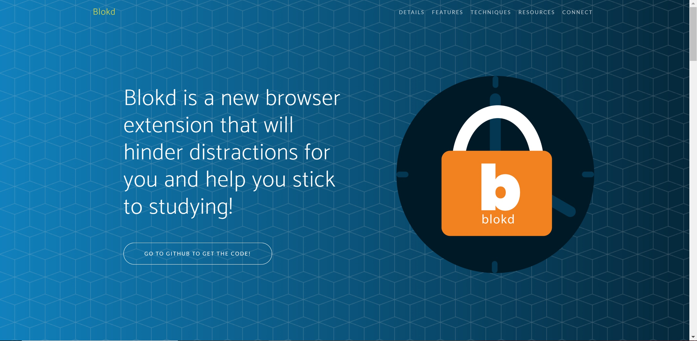
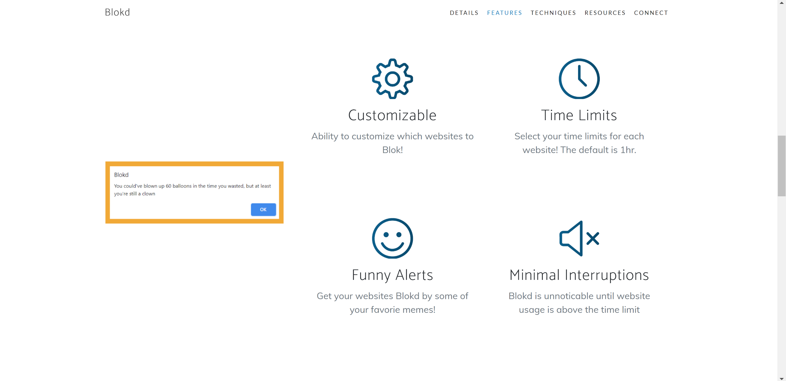
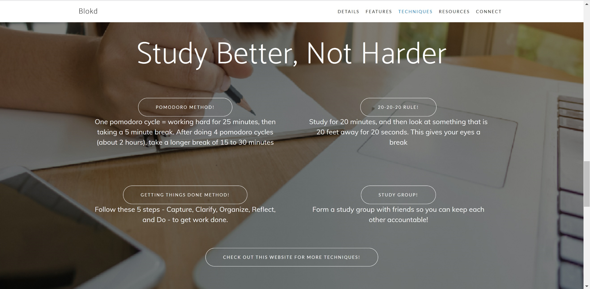
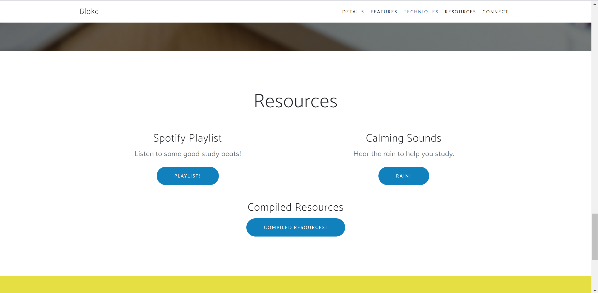

# Blokd

### What is Blokd?
Blokd aims to help students suffering from online school fatigue by minimizing online distractions and motivating them to stay on track and complete their work. Students will be able to use our extension to monitor their time spent on websites such as YouTube, Netflix, Hulu, and so many more. By keeping track of allotted screen time and alerting users when their time for these websites is up, Blokd offers a simple yet effective solution for combatting distraction.

### Our Inspiration
A little over a year ago, life as we knew it came to a drastic halt as the COVID-19 pandemic began to spread. All daily activities, most notably university classes and work, shifted from being in-person to being totally online. With this shift came the need to adapt to staring at screens all day, which limits one’s attention span and can quickly become tiresome. That is why we came up with Blokd, a Chrome extension that keeps you on track when you stray from the work you’re supposed to be doing. Blokd keeps track of the time you spend on distracting websites such as YouTube, Netflix, and Hulu and pops up a meme reminding you to stay on track when your time limit for these websites is reached. We built our extension from scratch by looking at tutorials online and built our accompanying informational website by building upon a bootstrap. Throughout the course of this project, we improved upon our Javascript, HTML, and CSS abilities, since we are all beginners at those languages, and figured out how to collaborate effectively via GitHub. We faced many challenges over the course of these 24 hours, namely having to work through bugs in our code that we were unfamiliar with and getting the Chrome extension to do what we envisioned for it to do.

## How Does Blokd look?

#### Here's how the Website looks?

##### Landing Page

##### Features Page

##### Study Techniques Page

##### Resources Page

##### Check out our website at `www.blokd.tech`

#### Here's how the Extension Alerts look?

##### Alerts

##### Pop-Up

# How to add the chrome extension?
1. Clone this repository: `git clone https://github.com/gloriasun4/Blokd`
2. Add it to your chrome extensions on `chrome://extensions/` with developer mode on
3. Select websites you want to limit times of. Default time limit is 1 hour total on all the websites you choose.
4. Do your work normally and if you go over your time limit, you will be blokd by some of your favorite memes!

### Contributors
This project was primarily built by the following people:
- [Tiki Djovic](https://www.linkedin.com/in/tijana-djokic/)
- [Wamia Said](https://www.linkedin.com/in/wamiasaid/)
- [Gloria Sun](https://www.linkedin.com/in/gloriasun4/)
- [Esha Tulsian](https://www.linkedin.com/in/esha-tulsian-076b731a7)